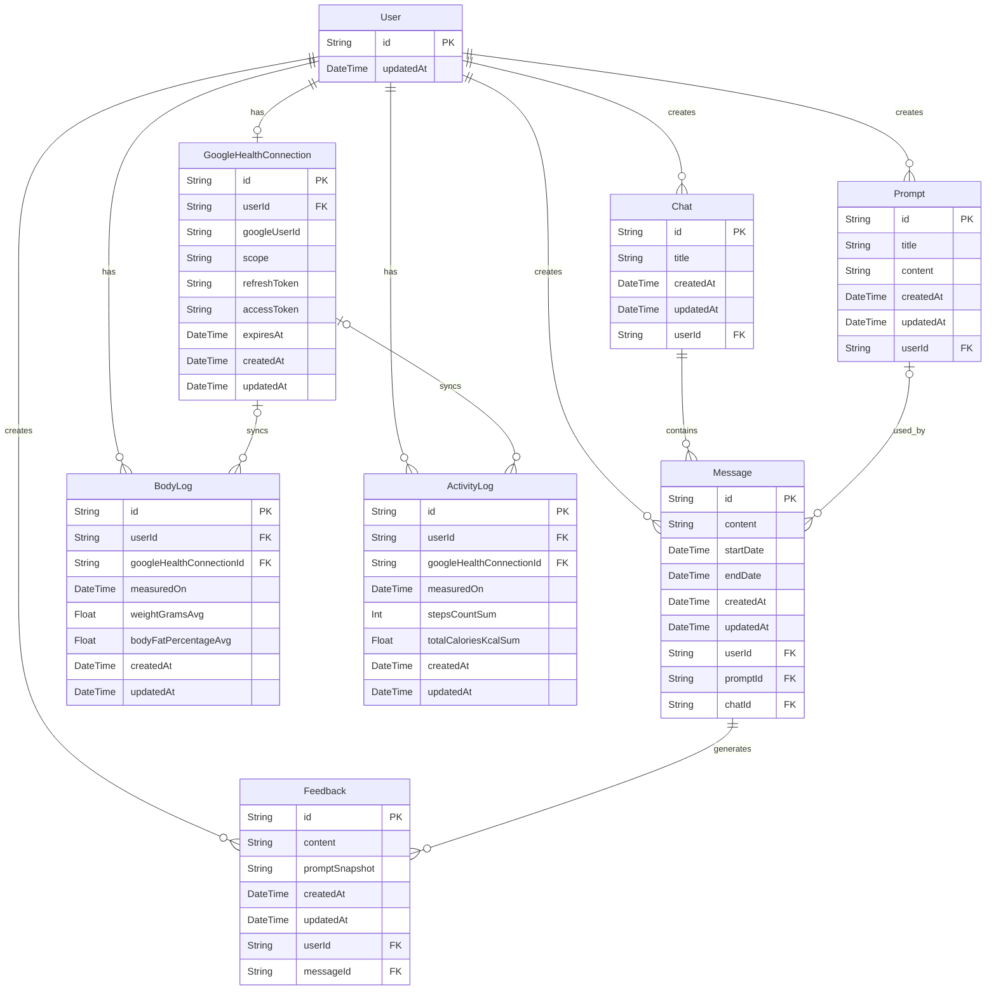

# FitLog AI

テキスト入力から始める AI フィードバック・ログ管理ツール。
日々の食事・筋トレなどをテキストで記録し、Google Health の数値と合わせて Gemini API がパーソナライズされたフィードバックを生成します。

## デモ

- **URL:** https://fitlog-ai-puce.vercel.app/auth/signin
- **メール:** demo@example.com
- **パスワード:** demo@exa

> ⚠️ デモアカウントは共有です。入力内容は他の閲覧者にも見える可能性があるため、個人情報は入力しないでください。

---

## 概要

### ターゲット

身体データ（体重・食事・筋トレ）を 1 箇所にまとめて AI のアドバイスが欲しい人。

### 課題

- 入力項目が多いアプリは面倒で挫折する
- 複数アプリの数値を自分で比較・分析するのが大変
- 現状は ChatGPT への手動コピペで運用している

### 解決策

1 つのテキストエリアにその日の体重・食事・筋トレをメモ帳感覚で書くだけで、AI が内容を読み取り翌日のアクションプランを提案する。

---

## 利用の流れ

1. サインアップ、またはデモアカウントでログイン
2. 「指示文」→「新規作成」から指示文を保存（例：「増量中なので強気な提案を」）
3. 「新しいチャット」からメッセージを入力し、指示文・期間・（任意で）外部検索を選んで AI 回答を生成
4. チャット詳細でメッセージと AI 回答を確認。同じチャットにメッセージを追加できる。編集するとメッセージ更新と AI 回答の再生成ができる
5. サイドバーやチャット一覧から履歴の確認・名前変更・削除ができる

Google Health を連携している場合、設定から期間指定で体重・体脂肪・歩数・消費カロリーを同期できます。指定期間のデータは AI への入力に含まれ、「健康データ」ページで推移を確認できます。

---

## 機能

### 実装済み

- 認証：ログイン・サインアップ・ログアウト（Supabase Auth）
- 指示文管理：AI 回答生成時に使う指示文の作成・詳細・編集・削除
- チャット管理：新規作成・同一チャットへの追加メッセージ・履歴一覧・詳細・名前変更・削除
- AI 連携：指示文＋メッセージ（＋任意の健康データ）を Gemini API に送信し、フィードバックを生成・保存・再生成
- 外部検索：生成時に Google 検索ツールを使うかどうかを選択可能
- Google Health 連携：連携・解除、期間指定で体重・体脂肪・歩数・消費カロリーを一括同期、健康データページの推移グラフ（Recharts）

### 今後

- Google Health の睡眠など、まだ取っていないデータの取得
- 筋トレ管理（Markdown 記録・ボリューム推移グラフ）
- データ CSV / Markdown エクスポート
- ダッシュボードの拡充

---

## ER図



---

## 技術スタック

| カテゴリ       | 技術                                                   |
| -------------- | ------------------------------------------------------ |
| フロントエンド | Next.js 16 / TypeScript / Tailwind CSS / shadcn/ui     |
| フォーム       | auth: useActionState / 主要機能: react-hook-form + Zod |
| バックエンド   | Supabase（Auth・DB）/ Prisma ORM                       |
| AI             | Gemini API（`@google/genai`）                          |
| グラフ         | Recharts                                               |
| デプロイ       | Vercel                                                 |

---

## 外部 API

| API                            | 用途                                                         |
| ------------------------------ | ------------------------------------------------------------ |
| Gemini API（gemini-2.5-flash） | 指示文・メッセージ・健康データを元に AI フィードバックを生成 |
| Google Health API              | 連携・体重・体脂肪・歩数・消費カロリーの取得と同期（睡眠などは今後） |

---

## 開発支援・品質管理

- CodeRabbit：PR 差分の自動レビューにより、バグリスク・可読性・保守性の確認を補助

---

## ローカル開発

```bash
git clone https://github.com/West-tm/fitlog-ai.git
cd fitlog-ai
npm install
cp .env.example .env.local
```

Windows PowerShell の場合:

```powershell
Copy-Item .env.example .env.local
```

`.env.local` に環境変数を設定してください。

### 必須

- `DATABASE_URL`
- `DIRECT_URL`
- `NEXT_PUBLIC_SUPABASE_URL`
- `NEXT_PUBLIC_SUPABASE_PUBLISHABLE_KEY`
- `GEMINI_API_KEY`

### Google Health 連携を使う場合

- `GOOGLE_HEALTH_CLIENT_ID`
- `GOOGLE_HEALTH_CLIENT_SECRET`
- `GOOGLE_HEALTH_TOKEN_ENCRYPTION_KEY`
- `GOOGLE_HEALTH_API_BASE_URL`
- `GOOGLE_HEALTH_REDIRECT_URI`
- `GOOGLE_HEALTH_SCOPES`（歩数・消費カロリーには `activity_and_fitness.readonly` が必要。既存連携は再同意が必要）

```bash
npx prisma generate
npm run dev
```

[http://localhost:3000](http://localhost:3000) でアクセス
